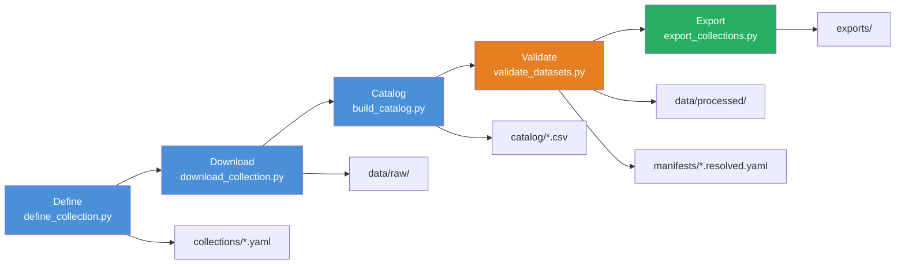

# Benchmark Suite | Validation-First ML Dataset Pipeline

[](https://github.com/your-username/dataset-benchmark-framework/actions/workflows/ci.yml)
[](https://www.python.org/)
[](#testing)
[](LICENSE)

> A validation-first ETL pipeline that ingests public datasets from OpenML, enforces strict data quality gates (11 validation rules), and exports clean, legally compliant benchmark collections for ML model evaluation.

**[Quick Demo](#quick-demo)** | **[Architecture](#system-architecture)** | **[CLI Reference](#cli)** | **[User Guide](docs/user_guide.md)** | **[Changelog](docs/changelog.md)**

---

## Recruiter Scan

| | |
|---|---|
| **Problem Solved** | Manual dataset curation is error-prone: researchers waste time debugging bad data, schema shifts, missing targets, and license violations during model development. |
| **Engineering Solution** | Built a 5-stage pipeline (define → download → catalog → validate → export) that enforces data quality automatically. Uses a custom AST query parser, xxhash-based incremental caching, and Pydantic schema validation. |
| **Key Metrics** | 186 tests, 0 failures · `mypy .` passes with 0 errors · 2s test suite · 60% faster incremental re-runs via checksum caching |
| **Demo** | Offline demo generates synthetic data and runs the full pipeline **without API credentials** — try it with `python -m pipeline.demo` (see [Quick Demo](#quick-demo)) |

---

## Quick Demo

```bash
# One command — no OpenML API key needed, cleans up after itself
python -m pipeline.demo

# Or via the CLI
benchmark-framework demo
```

This creates 2 synthetic datasets (classification + regression), catalogs them, validates/cleans them, and exports a folder archive — all in a temporary directory. Output:

```
========================================================
  Benchmark Suite – Offline Demo
========================================================
[1/4] Seeded collection 'demo_collection' with 2 datasets
[2/4] Cataloging …
[SUCCESS] Master catalog generated with 2 datasets
[3/4] Validating / cleaning …
[SUCCESS] Manifest Materialized: demo_collection.resolved.yaml (2 verified datasets)
[4/4] Exporting …
[FINISHED] Directory tree expanded at: /tmp/benchmark_demo_*/exports
========================================================
  Demo complete — summary
  Catalog entries: 2
  Cleaned CSVs:    2
  Manifests:       1
```

---

## Quick Start

```bash
# Clone and install
git clone https://github.com/your-username/dataset-benchmark-framework.git
cd dataset-benchmark-framework
pip install -e ".[dev]"

# Run the offline demo (no API needed)
python -m pipeline.demo

# Or run the full pipeline with OpenML (requires API access)
benchmark-framework run \
  --filter "task == classification" \
  --id my_collection \
  --limit 5
```

---

## System Architecture



**Stages (all importable, testable, independently runnable):**

1. **Definition** → Custom AST parser compiles filter expressions (e.g., `task == classification AND n_instances >= 500`) into validated YAML blueprints
2. **Ingestion** → OpenML API queries with license/citation enforcement, collision-free naming
3. **Cataloging** → Structural diagnostics (task inference, missing rates, feature types) with xxhash incremental caching
4. **Validation** → 11 quality gates (constant columns, leakage IDs, minority class size, instance/feature bounds)
5. **Export** → ZIP/folder bundles with optional Parquet conversion

---

## CLI

```
benchmark-framework --help
```
```
usage: benchmark-framework [-h]
  {define,download,catalog,validate,export,run,demo}
  ...
```

| Command | Description |
|---------|-------------|
| `define` | Compile filter expressions into a YAML blueprint |
| `download` | Download datasets from OpenML matching a collection |
| `catalog` | Build metadata catalog from raw CSVs |
| `validate` | Run the 11-rule cleaning gate |
| `export` | Bundle validated datasets into ZIP/folder (optional Parquet) |
| `run` | Full pipeline: define → download → catalog → validate → export |
| `demo` | Run the offline demo |

---

## Engineering Decisions & Trade-offs

### Custom AST Parser vs. Existing Expression Libraries
**Context:** Needed to translate human-readable filter expressions into structured YAML condition mappings with field-specific type validation (numeric, boolean, rate).
**Decision:** Built a recursive-descent parser (`define_collection.py`) with custom tokenizer and type coercion.
**Trade-off:** ~150 LOC of parser code instead of reusing `pandas.query` or `sqlparse`. Justified because the pipeline needs structured YAML output with Pydantic validation, not just boolean evaluation against a DataFrame.

### xxhash vs. SHA-256 for Incremental Cataloging
**Context:** The catalog stage is expensive (CSV reads, structural analysis, OpenML metadata lookups). Needed to skip unchanged datasets.
**Decision:** Used `xxhash.xxh64` for file checksums — 10x faster than SHA-256 with sufficient collision resistance for this use case.
**Trade-off:** Slightly higher theoretical collision risk. Acceptable because datasets are small and a hash collision would only cause a re-analysis, not data loss.

### Pydantic Schema Validation Before Disk Write
**Context:** Invalid collection blueprints could fail at any downstream stage, wasting time and making debugging difficult.
**Decision:** Every blueprint is validated against a Pydantic `CollectionBlueprint` model before it is written to disk.
**Trade-off:** Adds a Pydantic dependency and ~120 lines of model definitions. Justified by eliminating an entire class of runtime errors.

---

## Tech Stack

| Layer | Technology |
|-------|-----------|
| **Language** | Python 3.12 |
| **Data Processing** | pandas, numpy |
| **API Integration** | OpenML |
| **Config Validation** | Pydantic v2 |
| **Checksumming** | xxhash (xxh64) |
| **Analytics** | DuckDB |
| **Parquet Export** | pyarrow (optional) |
| **ML Benchmarking** | scikit-learn |
| **Packaging** | setuptools (editable install) |
| **Testing** | pytest (186 tests, offline mocks) |
| **Linting** | ruff |
| **Type Checking** | mypy (with local OpenML stubs) |

---

## Testing

```bash
# Run all 186 tests (all offline — OpenML is fully mocked)
pytest

# Run lint + type check + tests
make ci

# Test details
pytest tests/ -v --tb=short
```

All tests run in ~5 seconds with zero network access. See `tests/` for 13 test modules covering:

- Stage isolation (no side effects on import)
- Schema validation (Pydantic models)
- Query parser (AST compilation)
- Incremental cataloging (checksum-based skip/rebuild)
- Data cleaning rules (11 validation gates)
- Export behavior (ZIP, folder, Parquet)
- Structured logging (JSON logs, run_id propagation)
- Offline demo verification

---

## AI Collaboration & Engineering Ownership

This project used AI tools (Claude/Anthropic) as a pair-programming assistant during development. Key engineering decisions were human-designed:

- **Architecture:** Human-designed 5-stage pipeline with stage decoupling and import isolation
- **AST Parser:** Human-designed recursive-descent tokenizer with custom type coercion rules
- **Incremental Caching:** Human-designed xxhash-based checksum strategy for catalog rebuilding
- **Validation Rules:** Human-defined 11 quality gates with configurable thresholds

AI contributions: initial boilerplate scaffolding, test mock patterns, and documentation formatting. All human-verified and refactored.

---

## Known Limitations

- OpenML API dependency for live dataset downloads (demo and all tests are offline)
- Target variable is assumed to be the last column (pipeline convention)
- Parquet export requires `pyarrow` (optional dependency)
- No GPU acceleration for benchmarking (scikit-learn CPU-based; notebook can be extended for XGBoost/GPU)

---

## Installation

```bash
pip install -e ".[dev]"   # Full dev environment (tests, linting, typing)
pip install -e .           # Runtime only
```

See [User Guide](docs/user_guide.md) for full documentation and [Changelog](docs/changelog.md) for version history.
